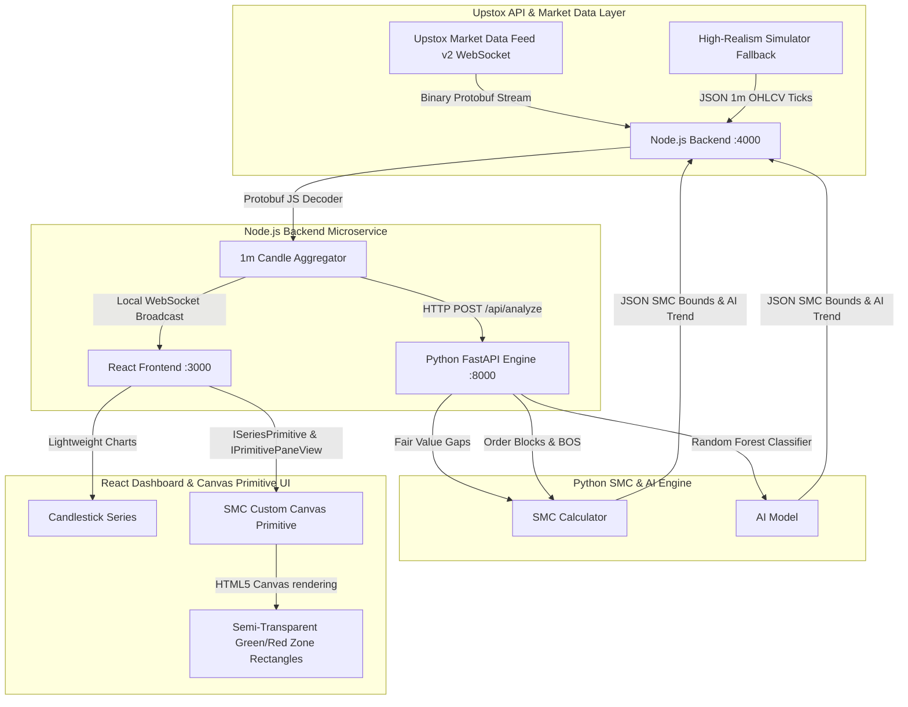

# DREGRO — Nifty 50 Smart Money Concepts (SMC) & AI Algorithmic Trading App

> Real-time Nifty 50 market data ingestion via Upstox API v2 Protobuf WebSocket, automated Smart Money Concepts (FVG, Order Blocks, BOS) calculation engine, Random Forest directional trend classification, and dynamic TradingView Lightweight Charts canvas primitives visualization.

---

## ✨ System Architecture & Overview



---

## 🔥 Key Features

1. **Upstox API v2 Protobuf Streaming**:
   - Authenticates via OAuth token endpoint (`/v2/login/authorization/token`) and retrieves authorized WebSocket feeds.
   - Decodes binary Protobuf market streams (`MarketDataFeed.proto`) using `protobufjs` for `"NSE_INDEX|Nifty 50"` in `"full"` subscription mode.
   - Includes an automatic fallback tick simulator so the system functions end-to-end 24/7 even outside market hours or without credentials.

2. **Smart Money Concepts (SMC) Engine**:
   - **Fair Value Gaps (FVG)**: Detects 3-candle imbalance sequences.
     - *Bullish FVG*: Low of candle 3 > High of candle 1.
     - *Bearish FVG*: High of candle 3 < Low of candle 1.
   - **Break of Structure (BOS)**: 5-period rolling window swing high/low detection. Triggers when price candle closes beyond prior swing levels.
   - **Order Blocks (OB)**: Identifies the last opposite-colored candle preceding the BOS impulse move.
   - **Right-Side Projection**: Automatically projects zone coordinates into future timestamps so rectangles extend to the right edge of chart panes until price mitigates them.

3. **Random Forest AI Directional Trend Classifier**:
   - Real-time feature engineering (rolling returns, candle body ratios, moving average distances, volatility).
   - Trains a `RandomForestClassifier` to output market trend predictions (`Bullish`, `Bearish`, `Neutral`) with confidence percentages.

4. **TradingView Lightweight Charts Custom Canvas Primitives**:
   - Modern `ISeriesPrimitive` & `IPrimitivePaneView` HTML5 Canvas plugin (`SMCPrimitivePlugin.js`).
   - Converts `(time1, price1)` and `(time2, price2)` zone coordinates to exact canvas pixel bounds.
   - Bullish zones (OB/FVG): Semi-transparent green fill (`rgba(38, 166, 154, 0.2)`), green stroke, pill labels.
   - Bearish zones (OB/FVG): Semi-transparent red fill (`rgba(239, 83, 80, 0.2)`), red stroke, pill labels.
   - Re-renders smoothly during live price scale shifts and time scale panning.

---

## 🛠️ Tech Stack

- **Frontend**: React, Tailwind CSS, `lightweight-charts`, `lucide-react`, Vite.
- **Backend**: Node.js, Express, `ws` (WebSocket), `protobufjs`, `axios`, `dotenv`.
- **AI / SMC Engine**: Python 3.11, FastAPI, Uvicorn, Pandas, scikit-learn, NumPy, Pydantic.

---

## 🚀 Quick Start Guide

### Prerequisites
- Node.js v18+ 
- Python 3.11+

### 1. Python FastAPI Microservice (`python_engine/`)
```bash
cd python_engine
python -m venv .venv
# On Windows: .venv\Scripts\activate | On Unix: source .venv/bin/activate
pip install -r requirements.txt
python main.py
```
*Microservice runs on `http://localhost:8000`*

### 2. Node.js Backend Server (`backend/`)
```bash
cd backend
npm install
npm start
```
*Backend server & WebSocket run on `http://localhost:4000` (WS: `ws://localhost:4000`)*

### 3. React Frontend Dashboard (`frontend/`)
```bash
cd frontend
npm install
npm run dev
```
*Frontend app runs on `http://localhost:3000`*

---

## 🔑 Upstox Credentials (.env Configuration)

Copy `backend/.env.example` to `backend/.env` to configure your live Upstox v2 API credentials:

```env
PORT=4000
PYTHON_ENGINE_URL=http://localhost:8000/api/analyze

CLIENT_ID=YOUR_CLIENT_ID
CLIENT_SECRET=YOUR_CLIENT_SECRET
REDIRECT_URI=http://localhost:4000/callback
AUTH_CODE=YOUR_AUTH_CODE
ACCESS_TOKEN=YOUR_ACCESS_TOKEN
```

*(If credentials are omitted, the Node.js backend automatically runs in simulator mode).*

---

## 🧪 Automated Integration Tests

Run the full-stack integration test suite to verify all microservices and WebSocket streams:

```bash
cd backend
node test_integration.js
```

---

## 📜 License

MIT License. Developed for algorithmic trading visualization and market analytics.
